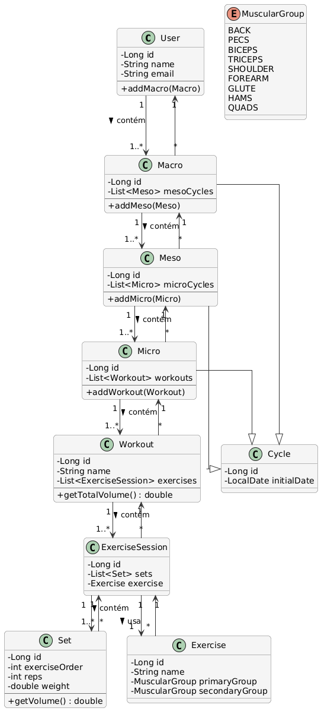

# Project Name: EuroTreino API

A RESTful API built with Java and Spring Boot to manage periodized workout routines. The focus is on performance, clarity, and backend best practices.

---

## 📌 Project Purpose

The goal of this project is to develop an API to register workouts, training cycles (macro, meso, micro), exercises, training sessions, and calculate metrics such as muscle group volume. It serves as practice for domain modeling, JPA relationships, and efficient aggregate calculations.

---

## 🚀 Technologies Used

- Java 21 (Zulu JDK)
- Spring Boot
- Maven
- PostgreSQL
- JPA / Hibernate
- Lombok

---

## 🧭 Domain Model (UML)

Below is the current UML diagram representing the core domain of the API:

---

## 🧱 Development Progress

## 🧱 Development Progress

| Milestone                    | Description / Challenge                                                                                                                                               | Solution or Lesson Learned                                                                                                                                                                                                                  |
|-----------------------------|------------------------------------------------------------------------------------------------------------------------------------------------------------------------|----------------------------------------------------------------------------------------------------------------------------------------------------------------------------------------------------------------------------------------------|
| Initial project setup       | Created the UML diagram, the PostgreSQL database, defined the internal package structure, configured `application.properties`, set up `.gitignore`                    | The UML structure was first drawn on paper, then recreated using PlantUML. The database was created using pgAdmin4. Package structure was defined using Eclipse IDE. Sensitive credentials were extracted to an `application.properties.example` file and ignored via `.gitignore`, along with other unnecessary files. |
| Entity modeling             | Entities `MuscularGroup`, `Exercise`, and `Cycle` were created to represent the core of the training logic                                                             | Applied `@Enumerated(EnumType.STRING)` for better database readability, based on community best practices and recommendations.                                                                                                               |
| Modeling `Workout` and `Micro` | Faced challenges using `@OneToMany` and `@ManyToOne` annotations, especially when managing sets, reps, and weight lifted for accurate volume calculations            | After studying the official documentation, the entity mapping issues were resolved. To handle training data properly, the UML diagram was updated and two new entities were added: `Set` (stores set order, reps, and weight) and `ExerciseSession` (contains the exercise and its list of sets, including a method `getTotalVolume()`). |

---

## ⚠️ Challenges Faced

- Understanding bidirectional relationships in JPA
- Avoiding infinite JSON serialization loops with `@OneToMany` / `@ManyToOne`
- Handling JSON serialization issues caused by infinite loops (`@JsonManagedReference`, `@JsonBackReference`)
- Structuring packages (e.g., `entity`, `repository`, `service`, `controller`) in a clean and scalable way
- Deciding where to place logic: entity vs. service
- Designing a flexible and clear database schema

---

## ✅ Key Learnings

- Best practices for entity modeling in Java
- Differences between entities, enums, and DTOs
- Practical usage of JPA and Hibernate with Spring Boot
- How to structure a modular, maintainable backend API
- The importance of modeling the domain before coding

---

## 🛠️ Next Steps

- [ ] Create CRUD endpoints for all main entities
- [ ] Add DTOs and mappers to separate concerns
- [ ] Implement unit and integration tests
- [ ] Set up Swagger for API documentation

---

## 🤝 Contact

If you'd like to learn more about this project or collaborate with me:

- GitHub: [Victor-f-Paiva](https://github.com/Victor-f-Paiva)
- LinkedIn: [Victor Paiva](https://www.linkedin.com/in/victor-paiva-b4392ab7/)

---

> 💬 *This project is part of my career transition into backend development. Documenting my progress helps me reflect, improve, and demonstrate my growth to opportunities.*
